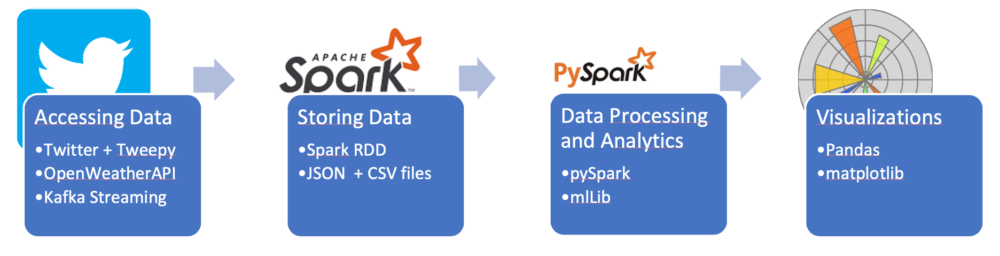
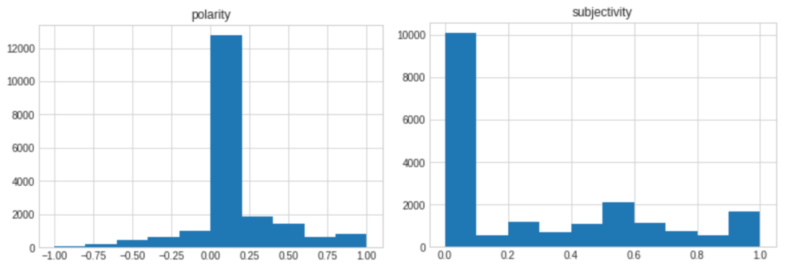
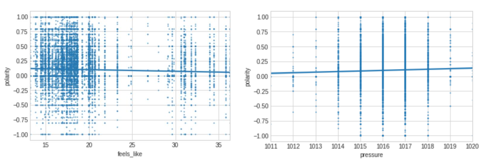
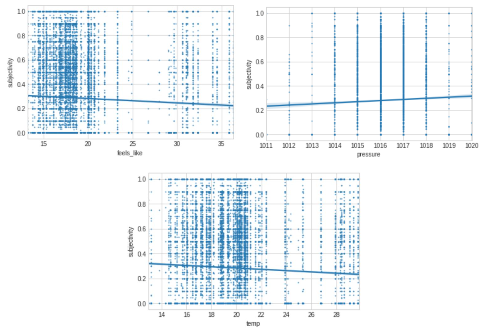
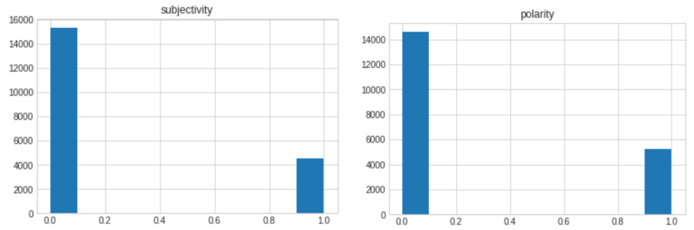

# Analysis of Emotions expressed in Tweets based on the weather conditions (using Apache Spark and Kafka)

- [Project Overview](#project-overview)
- [Research Question](#research-question)
- [The Data](#the-data)
- [Data Processing](#data-processing)
- [Data Analytics](#data-analytics)
  - [Sentiment analysis](#sentiment-analysis)
  - [Linear Models](#linear-models)
  - [Logistic regression](#logistic-regression)
  - [Naïve Bayes model](#naïve-bayes-model)
- [Folder Structure](#folder-structure)
- [Requirements](#requirements)
- [Notes](#notes)
- [Authors](#authors)

## Project Overview

As extreme weather conditions and fluctuations become more frequent, it is necessary to understand how this influences people on a psychological level. With global warming causing the weather to fluctuate more than ever before, we aim to research how different weather conditions affect people’s thoughts and moods. It is inevitable to understand how weather changes affect us, and perhaps the fight against climate change would become more effective if people were able to internalize it, due to climate change affecting their psychological wellbeing negatively.

This project aims to explore data streaming using Apache Kafka for sentiment analysis. Since the main focus was to explore building a NLP pipeline for classification using Apache Spark, there might be some strong assumptions concerning the data.

## Research Question

The question that we are focusing on with this project is the impact that the weather has on the feelings and thoughts that people express through Tweets. Namely, we are investigating how different weather conditions affect the sentiment and polarity of Tweets.

## The Data

The architecture and the libraries used in the accessing, processing and analysing of the data are fully scalable. Most of all, by using the Twitter API the project would be able to access nearly unlimited amounts of data if a more powerful machine or more processing time was used for this project. To work with big data of this kind, the Spark MLlib analysis can be utilized to deliver better results.


Thus, when looking at it from the “5 V’s” perspective, the volume is clearly present, variety is provided due to the nature of Tweets, which can be very diverse in contents. The same applies to the veracity criteria. Velocity is achieved using the Tweepy+Kafka combination, and the value lies in the possible insight on human emotions, which is the research question of this project.



We access both the Twitter and the Weather data from APIs.

For the Tweets part, a connection to the TwitterAPI is opened using `tweepy` and our credentials in the Twitter Producer Notebook. For the streaming data, Apache Kafka managed by Zookeeper is used. Upon the opened Tweets Stream, a Kafka Consumer notebook reads the Stream and loads the data into the SparkSession. The text of the Tweets is processed right away and the `textblob` library is used for common natural language processing (NLP) to find the polarity and subjectivity of the tweet. The data frames are then split based on specifically selected locations and the preprocessed data is saved to JSON files. Parameters in the JSON include time, text, location, subjectivity and polarity of the tweet. For the weather part, the OpenWeatherMap API is used to download the data with pyspark and saved it locally in csv files.

The data is then processed and analyzed with spark using the PySpark and PyOWM, DateUtil and Spark MLlib amongst others (see [Data Processing](#data-processing)). For the visualizations, we used `pandas` in combination with `matplotlib` due to our familiarity with the technology and because the size of the resulting dataset allowed us to step away from Big Data technologies. However, there are also technologies optimal for the visualizations part.

Additional imported modules from the python standard library include `os` (“miscellaneous OS interfaces”), `sys` (installing libraries with `pip` from jupyter notebook instead of the terminal), or `datetime`.

## Data Processing

For the data processing, our goal was to merge the two datasets in a way that would allow us to implement the models and analysis without issues. As the joined dataset consists of almost 20,000 observations, we had to do this in a scalable matter and to be aware of the computing power necessary to perform it making the Spark environment ideal for this data project.

As the two datasets are location specific, we had to merge them appropriately, and we did this in a manner that the specific Tweet contains all the necessary weather data that is needed to analyse it. To achieve this, we merged the two datasets on the hour in which the Tweet was published, due to the weather data being collected on hourly basis. To perform this, we used the parser package to format the data from the Tweets, more specifically the column “created_at”. The creation time of the Tweet also had to be formatted to the UNIX time format, to match the weather data, as well as to be rounded to the closest hour. For this, we used the `date_trunc` function as well as the `unix_timestamp` function.

As mentioned above, the datasets for the Tweets were quite large as there are eight of them for the different locations we choose and the same applies to the weather data. To scale our code, we iterated it over the different location-specific datasets for tweets and joined it with the appropriate weather dataset. As the last step, we appended the joined location-specific datasets to the final spark data frame which will be used for further analysis. Hence, the result of our data processing is one data frame that contained the Tweets, their location, the subjectivity, the polarity as well as the weather data for the hour in which the Tweet was created.

## Data Analytics

### Sentiment analysis

In order to determine the nature and emotion of the Tweets we have gathered, we used a sentiment analysis which would give us two scores: polarity and subjectivity. The polarity of the tweet is a value that lies between -1 and 1 and tells us the feeling a person expresses in the text, -1 if negative and if 1 positive. The other value is subjectivity which is from 0 to 1 and expresses whether the tweet is subjective, expressive of one’s opinions, or if it is objective and states facts. A subjective tweet would have a 1 score, while an objective one would have a 0 score.



The figure above suggests that most of the tweets in our analysis tend to be neutral or slightly positive while the subjectivity of the tweets tends to be mostly neutral. For the purpose of our analysis, it would be ideal if these two independent variables followed normal distribution which we would definitely try to improve in the future by drawing more random observations from different days of the year.

### Linear Models

Linear regression is a modelling approach used to investigate the relationship between a scalar response variable and explanatory variables. In our case, the response variables are the subjectivity and polarity of the Tweets, and the explanatory variables are the weather data, more specifically we choose to investigate the parameters of dew point, cloud coverage, the subjective temperature, the humidity, the air pressure, the temperature, the visibility, the wind degrees, and the wind speed.

For this model, we had to firstly tweak our data frame, and turn it into an RDD map, and secondly, we had to scale it to improve the accuracy of our model. Afterwards, we split the dataset into a training data set used to train our linear model featuring 80 percent of the observations and a test data set that would be used to test our model’s accuracy.

The coefficients of our model tell us what the estimated effect of our explanatory variables is on our response variables. For the polarity, there were only two variables that seemed to influence the response subjectivity value, and these were the subjective temperature as well as air pressure.



As depicted in the figure above, we observe a slightly negative relationship between subjective temperature and polarity that we could already observe from the coefficients of linear regression. When it comes to the impact of air pressure, the visualisation and the coefficient also confirm that it has a slightly positive impact on the polarity score.

However, both coefficients were quite low with the one for subjective temperature being -0.0014 and the air pressure coeffcient being 0.0046. This means that an increase of 1 in subjective temperature leads to a decrease of -0.0014 in polarity score and an increase of 1 in air pressure leads to an increase of 0.0046 in polarity score (keep in mind that the variables are scaled). This, as well as the very low R-squared value, which is a metric that tells us what proportion of the variation of the dependant variable is explained by the independent variable, of 0.00383 tells us that this model is not very good and does not show that weather has an impact on the polarity of the Tweets.

In the linear model for subjectivity, subjective temperature, pressure and temperature seem to have an impact on the subjectivity score. Moreover, the figure below suggests that subjective temperature and actual temperature have a slightly negative impact on subjectivity score while air pressure has a slightly positive impact on the score.



Based on the linear model, subjective temperature and pressure have coefficients of -0.0006 and 0.0018 respectively, and additionally, the variable temperature had a coefficient of -0.0025. The other explanatory variables have coefficients of 0 meaning that they do not have an impact on the subjectivity score. As with the previous model, the R-squared value is very low, being only 0.003367, which again leads us to conclude that this model does not show that the weather has an impact on the polarity in Tweets.

One possible issue in this could be that subjectivity and polarity are not in linear relation to the weather. Furthermore, the data visualisations do not suggest any other particular pattern, rather we see that some clusters could be present. Hence, we can conclude that weather does not affect subjectivity and polarity linearly and we will move on to other models to investigate the relationship further.

### Logistic regression

The logistic regression is a model that is used to run an analysis between a binary dependant variable and multiple independent variables in different forms. In our case, the dependant variable was not in binary form, however, we converted the response variables polarity and subjectivity into binary by creating a cut-off point. After implementing trial and error to determine the optimal cut off point, we decided to go with 0.6 for subjectivity and 0.2 for polarity. So, if the subjectivity value would be greater or equal to 0.6, the value would be converted to a 1, and otherwise to 0, and the same for polarity. In the case of polarity, 1 means that a tweet is positive and 0 covers neutral and negative connotations. For subjectivity, 1 represents that a tweet is subjective and 0 means that it is objective. As we can see in the figure below, the majority of tweets are not positive nor subjective where approximately 25 percent of tweets are subjective and around 30 percent are positive.



Regarding the actual model fit, we ran the analysis twice, firstly for a dataset including polarity, and secondly for subjectivity. The datasets also had to be adjusted, so that the values would be indexed based on the number of occurrences of the features in the dataset. After running the data through the pipeline, we created another column based on the features that would be explored in our model. The features that we decided to investigate were the cloud coverage, the subjective temperature, the humidity, the air pressure, the temperature, the visibility, and the wind speed.

After running our models, we got an accuracy value for the subjectivity model of about 77%, and about 73% for the polarity model. These seem to be quite high values which could suggest that our models are quite accurate. However, this might not necessarily be true, due to the response variables of polarity and subjectivity being not binary, the conversion to binary could have been too big of an assumption to make. Nonetheless, the model does show us that the weather features we have analysed have some effect on the probability of a tweet being either subjective or positive.

### Naïve Bayes model

The next model that we ran on our data was the Naïve Bayes model. This model is a classifier, meaning that it tells us whether a certain piece of data will be in a specific class. In our model we used the weather data as the features of a Tweet and ran the model twice, once with the subjectivity of the Tweet being the dependant variable, and once with the polarity.

Firstly, we had to index the different features of our weather data, in this case, we used the cloud coverage, the subjective temperature, the humidity, the air pressure, the temperature, the visibility and the wind speed. We chose these features to be suited for our model, as they are the ones where the fluctuation was not significant, and the indexing could be done.

The next step was to run our data through a pipeline to create indexed values of the features that we decided on in the previous step and to label the number of times they occur.

To train our model, we split the complete data set that we obtained into a training data set, and to a test dataset. The training dataset was used to train our model, while on the test dataset we would see how well the model classifies data based on the features which are present.

After training, our model was found to correctly classify approximately 30% of the dataset for the subjectivity, and for the polarity around 33%. The result is unfortunately not that high, which tells us that the weather features chosen by our model do not explain the subjectivity or the polarity of the tweets to a great extent. Hence, we cannot conclude that the weather does not have a significant impact on the subjectivity or polarity of tweets, at least in the eight cities we examined and over the given course of time.

## Folder Structure

```
|- tweets_with_weather                                  # Final merged dataset (Twitter data + Weather data) for each of 8 locations
|- Twitter 
|--- twitterProducer.ipynb                              # Notebook with code for starting the stream
|--- KafkaConsumerData_and_SentimentAnalysis.ipynb      # Notebook with code for saving the data from stream and running the sentiment analysis
|--- results_tweets                                     # Saved Tweets from the stream for each of 8 locations 
|--- weather_data                                       # Weather data for 01.07.2021 accessed from OpenWeather for each of 8 locations
|--- weatherdata.ipynb                                  # Notebook with code for accessing of Weather data
|- APIKeys.txt                                          # Twitter API keys
|- data_processing_and_analysis.ipynb                   # Notebook with code for combining datasets, models
```

## Requirements 

Both twitterProducer and KafkaConsumerData_and_SentimentAnalysis need to run simultaneously. To access the Twitter data, a developer account from Twitter is needed to get the API keys. Due to the licencing of such account, the tweets are not provided in this repository. Only the processed data is provided in order to stay GDPR compliant.

## Notes

To see the full results of the models, open the Jupyter notebook named `data_processing_and_analysis.ipynb`.

## Authors

Ema Vargova, Luka Corsovic, Jan Pytela, Beata Stingelova

